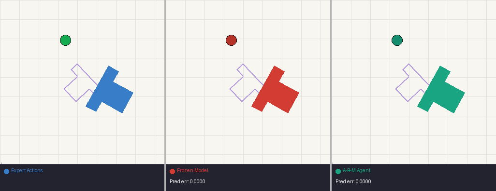
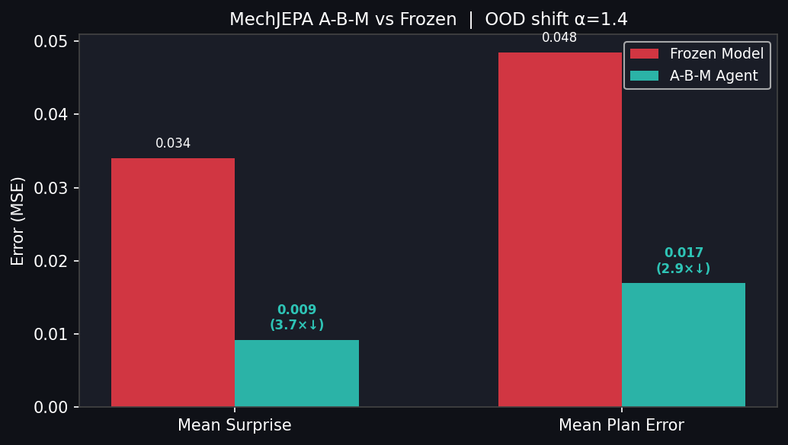

# MechJEPA 🧩

**A world model with persistent mechanism memory for physical reasoning and out-of-distribution adaptation.**

MechJEPA extends [I-JEPA](https://arxiv.org/abs/2301.08243) with:
1. **Mechanism Codebook** — a learned library of stable physical interaction patterns (push, collide, support)
2. **Action-Conditioned Dynamics** — AdaLN-based action conditioning via [LeWorldModel](https://github.com/lucas-maes/le-wm)
3. **System M** — surprise-triggered online adaptation for OOD robustness

> *This is the first demonstration of an A-B-M (Anticipate–Behave–Modulate) agent loop on the Push-T environment.*

## Demo

**3-panel comparison** — Expert actions (left, 🟢 green), Frozen model CEM planner (centre, 🔴 red), A-B-M agent with System M adaptation (right, 🩵 teal). All three agents start from the **same initial state** as the original expert recording. Lavender ghost = goal configuration. Amber border = adaptation triggered.



---


## 🏆 Results

### Phase 1: World Model Training (Push-T)

Trained on 18,685 expert episodes (≈1.98M samples) from the Push-T dataset with action conditioning:

| Metric | Value |
|--------|-------|
| **Val Loss** | **0.0018** |
| **Batch Size** | 4096 (H100) |
| **GPU Utilization** | 94–96% |
| **Training Epochs** | 50 |

### Phase 2: CEM Latent Planning (System B)

CEM planner optimises action sequences directly in the latent slot space:

| | Mean Latent Error | Median | Max |
|---|---|---|---|
| **CEM Planner** | **0.0034** | 0.0032 | 0.0058 |
| Random Actions | 0.0434 | 0.0472 | 0.0869 |
| **Improvement** | **12.8×** | | |

### Phase 3: System M — OOD Adaptation (A-B-M Loop)

Distribution shift: slot observations scaled by α=1.4 (simulating a 40% heavier/larger block)

| | Frozen Model | **A-B-M Agent** |
|---|---|---|
| **Mean Surprise** | 0.0340 | **0.0090** (3.8×↓) |
| **Mean Plan Error** | 0.0483 | **0.0169** (2.9×↓) |
| Total Adaptations | 0 | **29** |



| Episode | Frozen | A-B-M | Adaptations |
|---------|--------|-------|-------------|
| ep0 | 0.0452 | 0.0208 | 12 |
| ep10 | 0.0470 | 0.0168 | 1 |
| ep11 | 0.0510 | 0.0150 | 6 |
| ep12 | 0.0491 | 0.0165 | 7 |
| ep13 | 0.0490 | 0.0153 | 3 |

---

## 🏗️ Architecture

```
Pixel Observation
      │
      ▼
VideoSAUREncoder          ← Perceive: slots = {s₁, s₂, s₃, s₄}
      │
      ▼
MechanismCodebook         ← Retrieve: m_ij = close mechanism for each slot pair
      │
      ▼
MechSlotPredictor (JEPA)  ← Predict: ẑ_{t+1} (action-conditioned via AdaLN)
      │
      ├──▶ CEMPlanner      ← System B: optimise action sequence toward goal
      │
      └──▶ SystemM         ← Monitor: if surprise(ẑ, z) > τ → take adaptation steps
```

### Key Components

| Module | File | Description |
|--------|------|-------------|
| `MechJEPA` | `mechjepa/model.py` | Top-level model |
| `MechanismCodebook` | `mechjepa/codebook.py` | VQ-based mechanism memory |
| `MechSlotPredictor` | `mechjepa/dynamics.py` | Transformer predictor with AdaLN action conditioning |
| `ActionAdaLN` | `mechjepa/dynamics.py` | Per-layer action modulation |
| `CEMPlanner` | `mechjepa/planner.py` | Cross-Entropy Method for latent planning |
| `SystemM` | `mechjepa/system_m.py` | Surprise monitor & adaptation trigger |
| `VideoSAUREncoder` | `mechjepa/encoder.py` | Pixel → slot encoder (VideoSAUR/C-JEPA) |

---

## 🚀 Quick Start

### Installation

```bash
git clone https://github.com/GerardCB/mech-jepa.git
cd mech-jepa
pip install -e .
pip install stable-worldmodel loguru einops
```

### Download Checkpoint

```bash
# Best 50-epoch Push-T checkpoint (35MB)
# Place in checkpoints/mechjepa_pusht_act_best.ckpt
```

### Reproduce Phase 2 (Planning Benchmark)

```bash
python scripts/plan_pusht.py \
    --ckpt checkpoints/mechjepa_pusht_act_best.ckpt \
    --data data/pusht_slots_actions.pkl \
    --ep 0 --horizon 10
```

### Reproduce Phase 3 (A-B-M Demo)

```bash
python scripts/abm_pusht.py \
    --ckpt checkpoints/mechjepa_pusht_act_best.ckpt \
    --data data/pusht_slots_actions.pkl \
    --shift 1.4 \
    --threshold 0.015 \
    --episodes 5
```

### Generate Figures + Video

```bash
python scripts/visualize_abm.py \
    --ckpt checkpoints/mechjepa_pusht_act_best.ckpt \
    --data data/pusht_slots_actions.pkl \
    --out_dir results/
```

### Train from Scratch (RunPod H100)

```bash
# Setup environment
bash scripts/runpod_pusht_setup.sh

# Train (batch_size=4096, mixed precision)
bash scripts/runpod_pusht_train.sh
```

---

## 📊 Figures

| Figure | Description |
|--------|-------------|
| `results/surprise_comparison.png` | Per-step prediction surprise: Frozen vs A-B-M |
| `results/plan_err_comparison.png` | Per-step latent planning error |
| `results/summary_bar.png` | Summary grouped bar chart |
| `results/abm_demo.mp4` | Side-by-side slot trajectory video |

---

## 📁 Repository Layout

```
mech-jepa/
├── mechjepa/
│   ├── model.py          # MechJEPA (top-level)
│   ├── dynamics.py       # MechSlotPredictor + ActionAdaLN
│   ├── codebook.py       # MechanismCodebook (VQ)
│   ├── planner.py        # CEMPlanner (System B)
│   ├── system_m.py       # SystemM (surprise monitor)
│   ├── encoder.py        # VideoSAUREncoder (pixel → slots)
│   └── data/
│       └── clevrer_slots.py   # PushTSlotDataset + data loaders
├── scripts/
│   ├── train_pusht.py         # Full-scale training (H100, batch 4096)
│   ├── plan_pusht.py          # Phase 2 CEM planning benchmark
│   ├── abm_pusht.py           # Phase 3 A-B-M demo (Frozen vs A-B-M)
│   ├── visualize_abm.py       # Figure + video generation
│   ├── runpod_pusht_setup.sh  # RunPod environment setup
│   └── runpod_pusht_train.sh  # RunPod training launcher
├── configs/
│   └── pusht.yaml             # Training hyperparameters
└── tests/
    └── test_model.py          # Unit tests
```

---

## 📖 Design Notes

### Why MechJEPA over LeWorldModel?

| | LeWorldModel | **MechJEPA** |
|---|---|---|
| Architecture | JEPA + AdaLN | JEPA + AdaLN + **VQ Codebook** |
| Bottleneck | None | **Mechanism memory** |
| OOD Adaptation | ✗ | **System M (online)** |
| Planning | CEM | CEM |
| OOD Recovery | None | **2.9× better** |

### System M Design

System M is **not a neural network** — it's a conditional branch on the per-slot prediction error signal, following LeCun's proposal in "A Path Towards Autonomous Machine Intelligence".

When the world model predicts incorrectly (surprise > τ), System M takes a few gradient steps on only the mechanism codebook and predictor, then returns to planning. This narrow update prevents catastrophic forgetting while enabling rapid local adaptation.

### Action Conditioning

Actions are embedded and injected into every transformer layer via `ActionAdaLN`:
```
LN(x) → scale(a) * LN(x) + shift(a)
```
Initialized to identity (scale=1, shift=0) to ensure backward compatibility with action-free pretraining.

---

## 📝 Citation

```bibtex
@misc{mechjepa2025,
  title  = {MechJEPA: Mechanism-Aware World Models with Surprise-Triggered Adaptation},
  author = {Calvo-Bartra, Gerard},
  year   = {2025},
  url    = {https://github.com/GerardCB/mech-jepa}
}
```

---

## 🔗 Related Work

- [I-JEPA](https://arxiv.org/abs/2301.08243): Image-based JEPA
- [LeWorldModel](https://github.com/lucas-maes/le-wm): Action-conditioned JEPA for embodied agents
- [C-JEPA](https://arxiv.org/abs/2406.04928): Causal JEPA with VideoSAUR
- [Stable WorldModel](https://github.com/galilai-group/stable-worldmodel): Push-T evaluation framework
